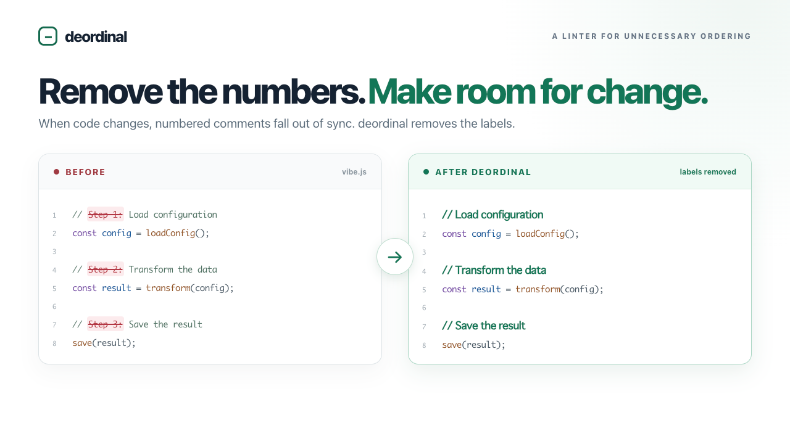

# deordinal



**Remove the numbers. Make room for change.**

LLMs often add `Step 1`, `Step 2`, and `Step 3` to comments and documentation. When things change, those labels fall out of sync and make simple edits harder. deordinal detects unnecessary ordering in Markdown and code comments, and can remove supported labels without changing the code itself.

## Installation

In JS/TS project: `pnpm add -D deordinal`

Global install: `cargo install deordinal --locked`

## CLI usage

```sh
cd your-project
deordinal init                 # create a configuration file
deordinal check                # recursively check the current directory
deordinal check README.md src  # check the specified files and directories
```

Autofix is experimental: rerun the same `check` command with `--write --unsafe` to apply supported edits.
Review the diff before committing; unsupported diagnostics remain unchanged.

Supported files: `.md`, `.js` / `.jsx` / `.mjs` / `.cjs`, `.ts` / `.tsx` / `.mts` / `.cts`, `.py` / `.pyi`

## Default rules

- `ordered-list`: Detects numbered Markdown lists, treating each list separately. Nested lists are separate lists.
- `prefix`: Detects labels at the start of prose, such as `1. Overview`, `1: Overview`, `A) Overview`, `(1) Overview`, and `① Overview`.
- `keyword-prefix`: Detects labels at the start of prose, such as `Step 1` and `Phase A`. Headings containing only a label are also checked.

Numbers with units, years, or versions are generally excluded. deordinal does not decide whether ordering is meaningful; it checks leading labels, not references within sentences.

## Configuration

Specify target files with `glob` patterns; use `!` to exclude files.

See the [JSON Schema](./configuration_schema.json) for details.

## How to suppress in markdown

For ordering that is necessary, use a reasoned range or file ignore directive in a standalone HTML comment.

Range ignore:
````md
<!-- deordinal-ignore-start: These instructions must be followed in order. -->
1. Stop the service
2. Create a backup
<!-- deordinal-ignore-end -->
````

Ignore the entire file:
````md
<!-- deordinal-ignore-file: This is an ordered operations manual. -->
````

Ordering in code comments is not needed, so ignore directives are not supported in them.
